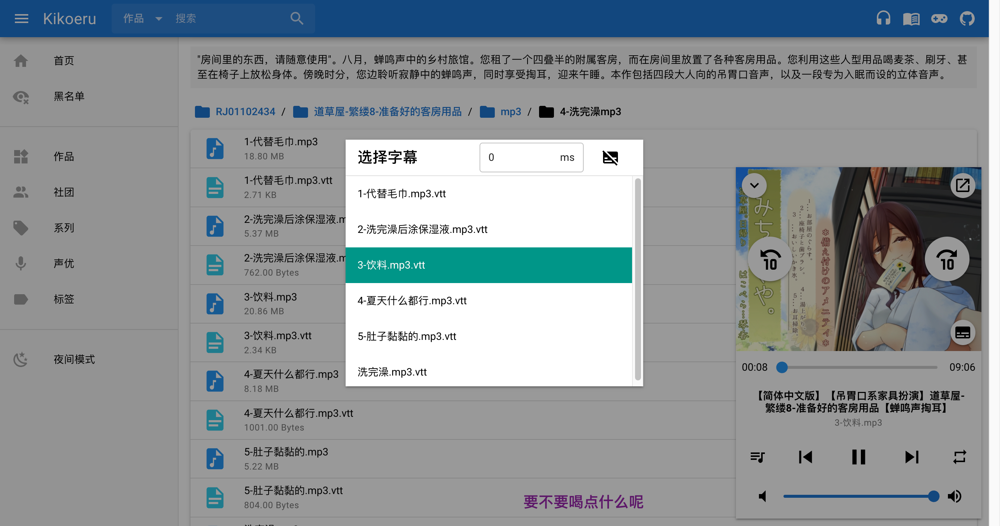
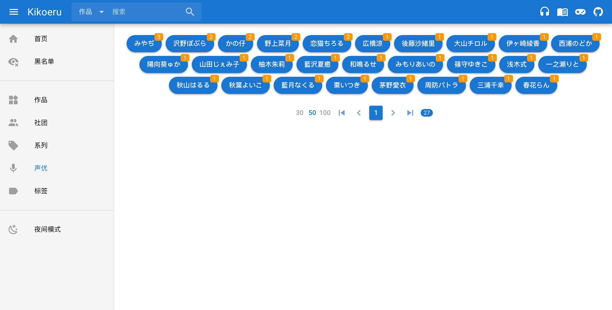

# Kikoeru

Self-hosted DLsite works database

## Preview







## Usages

```
Self-hosted DLsite works database

Usage:
  kikoeru [command]

Available Commands:
  cleanup     Cleanup works metadata
  completion  Generate the autocompletion script for the specified shell
  help        Help about any command
  refresh     Refresh works metadata
  start       Start the server
  sync        Sync works metadata

Flags:
      --debug   debug mode
  -h, --help    help for kikoeru

Use "kikoeru [command] --help" for more information about a command.
```

Change the current directory to `kikoeru` :

```bash
cd /path/to/kikoeru
```

### Start the server

```bash
./kikoeru start
```

### Sync works metadata

Put your works in the `media` folder, one work, one directory, and the directory name must fully matches the work id.

**Good:** `RJ334212`

**Bad:** `Rj334212` `rj334212` `334212`

Then execute the following command:

```bash
./kikoeru sync
```

### Refresh works metadata

```bash
./kikoeru refresh
```
